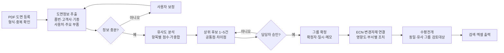

# AI 기반 하네스 유사도면 분류 및 설계변경(ECN) 관리 — 프로젝트 기획서

| 항목 | 내용 |
|---|---|
| 리포 | data09-07 |
| 제출자 | 이창덕 |
| 직무·소속 | 천일테크윈 개발 (첨부 기획서 표지 기재) |
| 과정 | 현장 데이터 디지털화 전문가과정 1차수 |
| 작성일 | 2026-09-28 (v0.3·v0.4·v0.5 2026-09-29, v0.6·v0.7·v0.8·v0.9 2026-09-30) |
| 문서 상태 | 초안 v0.9 — 2026-09-30 패들릿 요청(회사 로고 등록 · 회사 소개서 색조 적용) 반영, 화면 디자인만 바뀌고 기능은 v0.8 과 같음

제출자는 이미 15쪽 분량의 기획서(2차 개정안, 문제정의·PRD·핵심기능설명서·와이어프레임·플로우차트 포함)를 첨부했습니다. 이 문서는 그 내용을 개발 명세 관점에서 정리하고, 바로 만들 부분과 확인할 부분을 나눈 것입니다. 수치와 기준은 모두 첨부 기획서의 값입니다.

v0.2에서는 2026-09-28에 추가된 자료를 반영했습니다. UI 시안 PDF(화면 4종: 대시보드, 도면 등록·정보 추출, 유사도 결과·그룹 확정, ECN 관리)와 ECN OUTPUT(설계변경통보서 양식) 엑셀, 그리고 필요한 양식 목록 댓글(3 유사도 분석 결과표, 4 도면 그룹 목록, 5 ECN 요약표, 6 변경자재 목록, 14 유사 후보 적중 검증표)입니다. 화면은 UI 시안을, 엑셀 출력은 이 양식들과 설계변경통보서 배치를 따릅니다.

## 1. 추진 배경과 현안

하네스 신규 개발과 설계변경 업무에서는 고객사·기종별 PDF 도면이 계속 쌓입니다. 신규 요청이 오면 담당자가 파일명, 기억, 폴더 구조, 주변 인원의 경험으로 유사 도면을 찾고, ECN이 생기면 변경 전후 도면·BOM·변경자재·적용일·재고처리 정보를 따로따로 확인합니다.

| 문제영역 | 현재 상태 | 업무 영향 |
|---|---|---|
| 도면 검색 | 파일명과 담당자 경험에 의존 | 기준도면 선정 지연 및 재작성 |
| 유사도 판단 | 고객사·기종·형상·BOM을 수작업 비교 | 판단 기준의 개인차 |
| ECN 관리 | 도면·BOM·메일·변경표가 분산 | 변경내용과 적용시점 누락 가능 |
| 변경자재 | 신규·삭제·대체·수량변경을 직접 대조 | 구자재 오사용과 발주 오류 위험 |
| 수평전개 | 변경 영향이 있는 유사 도면 검색이 어려움 | 동일 문제의 반복 가능 |
| 업무 인계 | 과거 판단 근거가 담당자에게 귀속 | 백업 및 법인 이관 어려움 |

핵심 문제문장(원문): PDF 하네스 도면과 설계변경 자료가 축적되고 있으나, 도면 간 유사성 및 ECN 변경이력을 일관된 기준으로 연결하는 체계가 부족하여 검색시간, 판단편차, 변경자재 누락과 수평전개 미흡이 발생합니다.

원인(원문): 공통 분류기준 부재, PDF 도면·BOM·ECN·변경자재 목록의 분산 보관, 경험 의존적 유사도면 선정, 변경 전후 비교 결과를 구조화한 표준 데이터 부족, 변경유형과 적용시점을 함께 관리하는 화면 부재.

## 2. 목표

**최종 목표**
PDF 하네스 도면을 유사 그룹으로 추천하고, 담당자가 확정한 그룹에 ECN과 변경자재 이력을 연결해 도면 검색과 설계변경 영향 검토(수평전개 포함)를 한 곳에서 하도록 합니다. 운영원칙은 **AI는 후보를 추천하고, 최종 분류와 설계변경 판단은 담당자가 승인**하는 것입니다.

**1차 개발 목표 (교육기간 프로토타입)**
제한된 샘플 도면(10~20건)으로 **PDF 등록 → 정보 추출 → 유사 후보 → 그룹 확정 → ECN 이력 연결**을 처음부터 끝까지 시연합니다. 원문의 성공 기준은 도면을 완벽하게 자동 판독하는 것이 아니라, 유사 후보를 일관된 기준으로 제시하고 변경이력을 한 화면에서 확인하는 흐름을 보여 주는 것입니다.

원문의 교육단계 성과지표:

| 지표 | 측정방법 | 교육단계 목표 |
|---|---|---|
| 정보 추출 성공률 | 필수 항목 중 정상 추출 비율 | 샘플 기준 80퍼센트 이상 |
| 유사 후보 적중률 | 상위 3개 후보에 담당자 정답 포함 비율 | 샘플 기준 70퍼센트 이상 |
| 분류 소요시간 | 도면 1건 등록부터 후보 확인까지 | 5분 이내 |
| 변경자재 기록률 | 필수 변경항목이 이력표에 기록된 비율 | 필수항목 100퍼센트 표시 |
| 사용자 통제 | 추천 수정과 최종 승인 가능 여부 | 전 항목 담당자 수정 가능 |

## 3. 보유 데이터

원문 3.5 「주요 데이터 항목」을 그대로 데이터 구조로 씁니다.

| 데이터 | 형태 | 규모·주기 | 비고(민감도 등) |
|---|---|---|---|
| PDF 하네스 도면 | PDF (원본 PDF 우선, 스캔본은 OCR 보조) | 교육용 샘플 10~20건(동일 제품군 중심) | 고객사·품번 포함 — 교육 시 익명화 필요(원문) |
| 도면 정보: 도면 ID, 파일명, 품번, 품명, REV, 고객사, 기종, 사용처, 등록일 | 도면에서 추출 + 수정 | 도면당 1행 | 사용처 예: MAIN, CABIN, ENGINE, PANEL |
| 특징: 주요 커넥터, 회로 수, 분기 수, 주요 전선·보호재, 구조 키워드 | 추출 + 수정 | 도면당 1행 | |
| BOM (선택) | 미확인(엑셀 추정 — (가정)) | 도면별 | 커넥터·단자·전선·보호재 공용률 계산용 |
| 유사도: 비교 도면 ID, 총점, 속성점수, 부품점수, 형상점수, 추천순위 | 계산 결과 | 도면 쌍별 | |
| 그룹: 그룹 ID, 그룹명, 대표도면, 분류기준, 확정자, 확정일 | 담당자 입력 | 그룹별 | |
| ECN: ECN 번호, 변경사유, 변경 전후 REV, 요청일, 적용일, 상태 | 담당자 입력 | 최소 사례 1건(교육용) | 고객사 정보 포함 가능 |
| 변경자재: 자재품번, 변경유형(신규·삭제·대체·수량변경), 변경 전, 변경 후, 수량, 재고처리, 담당부서 | 담당자 입력 또는 전후 BOM 비교 | ECN별 | |
| 설계변경통보서 기본정보(v0.2 양식): ECN 번호, 문서분류, 작성일자, 설변 종류, 접수일, 개정 번호, 기종, 품번(변경 후), 변경 전 품번, 품명, 고객사, 고객 담당자, 변경 사유 구분, 도면 REV(전→후), 요청 출처, 설계 변경 목적, 변경 전 요청 내용, 변경 후 요청 사유·변경 내용 | 담당자 입력 | ECN별 | 결재란(작성·검토·승인·접수(품질)) 포함 |
| 적용 시점·재고 처리(양식 3절): 제품 적용일, 납품 적용일, 적용 조건, 적용 LOT·S/N, 선적용 여부, 정규 설변 예정일, 재고 처리 방안(종합) | 담당자 입력 | ECN별 | |
| 수신 부서 확인(양식 4절): 생산, 생산기술, 품질경영, 영업, 생산관리, 구매·자재별 확인자·확인일·비고 | 담당자 입력 | ECN별 | |
| 변경자재 내역(양식 5절): No, 변경 유형(신규·삭제·대체·수량변경·사양변경), 적용 위치(커넥터·회로), 변경 전 자재품번·사양·수량, 단위, 변경 후 자재품번·사양·수량, 증감(자동), 재고 처리, 담당 부서, 현재고(구자재) | 담당자 입력 | ECN별 최대 10행(양식 기준) | 양식에서 「사양변경」 유형이 추가됨 |
| 영향도 검토·부서별 조치(양식 6절): 도면, BOM, 작업지시서, 조립 JIG, 검사 JIG, 구매 발주, 구자재 재고 처리, 초도품·품질 승인, 포장·라벨·고객제출 9항목 × 해당 여부, 변경 전·후 기록물(번호·REV), 조치 내용, 담당 부서, 담당자, 완료 예정일, 완료일, 상태(자동) | 담당자 입력 + 자동 판정 | ECN별 9행 | |
| 수평전개 검토(양식 7절): 대상 품번, 기종, 고객사, 관계, 적용 여부, 검토 결과·사유 | 담당자 입력(동일 그룹·유사 도면 후보 제시) | ECN별 | |

## 4. 해결 방안 개요

원문 6.1~6.3 플로우차트를 개발 흐름으로 옮긴 것입니다.

- **수집**: PDF 도면 업로드(1건 또는 여러 건), 선택 메타정보·BOM·ECN 자료
- **정리**: 텍스트 추출(스캔본은 OCR 보조), 제목란·키워드 분석으로 도면 기본정보·특징 채우기, 담당자 수정
- **분석·AI**: 원문 3.6의 설명 가능한 가중치 방식으로 유사도 계산
  - 고객사·기종·제품군 25퍼센트 / 사용처·품명 20퍼센트 / 주요 부품·BOM 공용성 30퍼센트 / 도면 문자·키워드 15퍼센트 / 간단한 형상 특징 10퍼센트
  - 실제 가중치는 샘플 검증 결과로 조정(원문)
  - 임계값 이상이면 기존 그룹 후보, 미만이면 신규 그룹 후보(원문 6.2)
- **산출물**: 확정 그룹, ECN·변경자재 이력, 수평전개 대상, 엑셀 결과

## 5. 주요 기능

원문 FR-01~FR-10을 기준으로, 1단계 구현 범위를 반영해 우선순위를 표시했습니다. v0.2에서 UI 시안과 설계변경통보서 양식에 들어 있는 대시보드, 영향도·부서별 조치, 종결 확인, 수평전개 기록, 적중 검증을 MVP로 옮겼습니다.

| 기능 | 설명 | 우선순위 |
|---|---|---|
| 도면 등록 (FR-01) | PDF 1건·여러 건 등록, 파일명·등록상태 표시, 파일명·해시·품번·REV 기준 중복 경고 | MVP |
| 정보 추출 (FR-02) | PDF 텍스트 추출 → 품번·품명·REV·고객사·기종·사용처·키워드 후보, 원문 확인 | MVP |
| 추출정보 수정 (FR-03) | 모든 추출값을 담당자가 수정·저장, 수정값이 분석에 반영, 미인식 항목 경고 | MVP |
| 유사도 추천 (FR-04) | 가중치 방식 총점·항목별 점수, 상위 1~5건, 공통점·차이점 근거 | MVP |
| 가중치·임계값 설정 | 5개 항목 가중치와 기존/신규 그룹 임계값을 화면에서 조정 | MVP |
| 그룹 확정 (FR-05) | 기존 그룹 연결·후보 변경·제외·신규 그룹 생성, 확정자·일시·메모 기록 | MVP |
| 검색 (FR-06) | 품번·고객사·기종·사용처 조건 검색 | MVP |
| ECN 연결 (FR-07) | ECN 번호, 변경 전후 도면·REV, 변경사유, 요청일·적용일, 상태 | MVP |
| 변경자재 기록 (FR-08) | 신규·삭제·대체·수량변경·사양변경(v0.2 양식), 적용 위치, 변경 전후 품번·사양·수량·단위, 증감 자동 계산, 재고처리, 담당부서, 현재고 | MVP |
| 엑셀 출력 (FR-09) | 수강생 지정 양식 5종(3 유사도 분석 결과표, 4 도면 그룹 목록, 5 ECN 요약표, 6 변경자재 목록, 14 유사 후보 적중 검증표)과 설계변경통보서(ECN OUTPUT 양식 배치), 필터 결과 | MVP (원문은 선택, v0.2 양식 지정) |
| 유사 후보 적중 검증 (양식 14) | 도면별 담당자 정답 그룹을 입력하면 상위 3개 후보에 정답이 있는지 판정하고 적중률 집계(원문 성과지표 70퍼센트 목표와 비교) | MVP (v0.2) |
| ECN 영향도·부서별 조치 (양식 6절) | 9개 검토 항목의 해당 여부·기록물·조치·담당·예정일·완료일, 상태 자동 판정(미검토·비해당·완료·일정 미정·지연·진행 중) | MVP (v0.2, UI 시안 ECN 화면에 포함) |
| ECN 종결 확인 (양식 8절) | 적용 시점·재고 처리, 변경자재 재고처리 지정, 영향도·부서 조치, 수평전개 4개 항목을 자동 판정해 종결 가능 여부 표시, 불가 시 완료 처리 제한 | MVP (v0.2) |
| 수평전개 검토 기록 (양식 7절) | 동일 그룹·유사 도면을 대상 후보로 제시하고 적용 여부·검토 결과를 기록 | MVP (v0.2) |
| 대시보드 | 전체 도면 수, 미분류 도면, 검토대기, 진행 중 ECN, 최근 등록 도면, 추천대기 도면, 지연·미완료 ECN (UI 시안 화면 ①) | MVP (v0.2) |
| 전후 BOM 자동 비교 | 두 BOM을 비교해 변경유형 자동 분류 | 확장 |
| OCR 보조 | 스캔 PDF 문자 인식(DAY3 멀티모달) | 확장 |
| AI 추출 보조 | 제목란·주기 문장에서 필드를 생성형 AI로 추출(익명화 후) | 확장 |
| 형상·회로 정밀 비교 (FR-10) | PDF 형상과 회로 변경점 표시 | 확장(원문: 향후) |

## 6. 기대 산출물

- 브라우저에서 도는 유사도면 분류·ECN 관리 웹 도구(시연 화면: 대시보드, 도면 등록·분석, 유사도 결과·그룹 확정, ECN·변경자재)
- 도면 정보·특징 표, 유사도 결과 표, 그룹 목록, ECN 이력표, 변경자재 목록(엑셀)
- 검증 결과: 상위 후보 적중 여부, 처리시간, 추출 오류 및 보정 결과(원문 7절)
- 원문의 기획 산출물(문제정의·PRD·핵심기능설명서·와이어프레임·플로우차트)은 제출자가 이미 작성 완료

## 7. 기술 구성

| 과정 도구 | 이 과제에서의 쓰임 |
|---|---|
| 코랩(Python) | 샘플 PDF 텍스트 추출·가중치 유사도 계산을 먼저 검증, 적중률(상위 3개) 측정 (DAY2) |
| 멀티모달(OCR·도면) | 스캔 도면 문자 인식, 제목란 영역 인식 (DAY3, 확장) |
| Dify / NotebookLM | ECN 이력·과거 판단 메모를 넣어 "이 품번과 비슷한 과거 변경"을 묻는 노하우 조회 (DAY4, 확장) |
| Make | ECN 등록 시 관련 부서에 Gmail 알림, Sheets에 이력 기록 (DAY5, 확장) |
| 생성형 AI | 추출 보조, 유사도 근거 문장화 (익명화 전제) |

**개발 빌드**: 설치 없이 브라우저에서 도는 정적 웹 도구로 만듭니다.
- PDF 텍스트 추출은 브라우저 안에서 처리(pdf.js 등)해 도면이 외부로 나가지 않게 합니다. 원문 위험관리의 "회사정보 보안 — 외부 AI 입력 위험"에 맞춘 선택입니다.
- 데이터 저장은 1단계에서 브라우저 안 저장 + JSON/엑셀 내보내기·불러오기로 합니다(가정). 여러 부서가 같은 데이터를 봐야 하는 단계에서 공용 저장소(사내 공유 폴더의 엑셀 또는 DB)를 정합니다.
- 원문 비기능 요구(추적성: 수정자·승인자·수정일·ECN 상태 이력 보존, 확장성: 향후 OCR·BOM DB·PLM·ERP·MES 연결)를 데이터 구조에 반영해 3절의 항목을 그대로 테이블로 둡니다.

## 8. 개발 단계

**1단계 — 지금 바로 개발 가능한 부분**
원문에 데이터 항목, 가중치, 화면 구성, 예외처리, 완료 기준이 모두 정의되어 있어 다음은 샘플 도면 없이도 바로 만들 수 있습니다.
- UI 시안의 화면 4종(대시보드, 도면 등록·정보 추출, 유사도 결과·그룹 확정, ECN 관리)과 좌측 메뉴(도면 등록, 유사도 분석, 도면 그룹, ECN 관리, 변경자재, 설정), 상단 통합검색, 진행 단계 표시(1 등록 → 2 추출 검토 → 3 유사 후보 → 4 그룹 확정 → 5 ECN 연결), 화면 이동(대시보드 ↔ 도면 상세 ↔ ECN, ECN에서 대상 도면·유사 그룹으로 역이동)
- PDF 업로드·미리보기·텍스트 추출, 추출정보 편집 폼, 중복 경고
- 원문 3.6 가중치 방식 유사도 계산(가중치·임계값 조정 가능), 상위 1~5건과 공통점·차이점 표시
- 그룹 확정(확정자·일시·메모), 검색, ECN·변경자재 등록
- 설계변경통보서 양식 항목 입력(기본정보, 적용 시점·재고 처리, 수신 부서 확인, 변경자재 내역, 영향도·부서별 조치, 수평전개 검토)과 양식 8절 종결 자동 판정
- 엑셀 출력: 양식 3·4·5·6·14와 설계변경통보서 1건 출력(ECN OUTPUT 양식 배치를 따름)
- 유사 후보 적중 검증표: 담당자 정답 그룹 입력 → 상위 3개 적중 여부·적중률
- 검증은 익명화된 가상 도면 정보로 먼저 하고(가정), 제출자의 샘플 PDF 10~20건을 받으면 추출 규칙을 실제 제목란 양식에 맞춥니다.

**2단계**
- 실제 샘플 PDF 10~20건으로 제목란·품번 패턴 추출 규칙 조정 → 정보 추출 성공률 80퍼센트 이상 확인
- BOM 연결로 주요 부품·BOM 공용성(30퍼센트 항목) 계산
- 상위 3개 후보 적중률 70퍼센트 이상 확인, 가중치 조정
- ECN 사례 1건으로 데모 시나리오 10분 이내 시연 점검

**3단계**
- ECN 진행 알림, 부서별 조치 현황 집계, 대시보드 지표 확장
- 스캔 도면 OCR, 간단한 형상 특징(외곽·분기 수·배치) 추출
- Make 알림, Dify 이력 조회, 사내 공용 저장소 연결
- 향후: 형상·회로 정밀 비교, PLM·ERP·MES 연계(원문 고도화 범위)

**추가(2026-09-29)** — A·B 도면 그림 차이 적색 표시와 부품 표(BOM) 비교는 11장대로 1단계에 앞당겨 넣었습니다.

## 9. 기대 효과

- 유사 도면을 파일명·기억 대신 일관된 기준(가중치 점수와 근거)으로 찾아 기준도면 선정이 빨라지고 판단 편차가 줄어듭니다.
- ECN과 변경자재(신규·삭제·대체·수량변경), 적용일·재고처리를 한 화면에 묶어 구자재 오사용·오발주·적용시점 누락 위험을 낮춥니다.
- 확정 그룹을 따라 유사 도면을 검토대상으로 띄워 수평전개 누락을 줄입니다.
- 판단 근거(확정자·메모)가 기록으로 남아 업무 인계·법인 이관이 쉬워집니다.
- 부서별 기대효과(원문 1.5): 개발 — 기준도면 탐색·비교시간 단축, 설계 — 과거 변경이력 확인, 생산기술 — 변경 대상 치공구 사전 확인, 구매·자재 — 변경자재 누락·오발주 예방, 품질 — 연관 제품 검토범위 확보, 관리자 — 보고자료·의사결정 근거 확보

## 10. 확인 필요 사항

1. 익명화된 샘플 PDF 도면 10~20건과 ECN 사례 1건(원문 7절 데이터) — 제공 시점
2. 도면 PDF가 CAD에서 내보낸 텍스트 PDF인지, 스캔본인지 비율
3. 제목란 양식이 고객사별로 몇 종인지, 품번·REV 표기 규칙(예시 1~2개)
4. 사용처·제품군 분류 체계의 전체 목록(원문 예시: MAIN, CABIN, ENGINE, PANEL)
5. BOM 자료 형태(엑셀 컬럼)와 도면과의 연결 키(품번+REV인지)
6. 유사도 임계값 초기값 — 원문은 "임계값"만 기재, UI 시안에 "기준점수 70"이 표시되어 있어 1단계 초기값을 70으로 두고 설정에서 바꿀 수 있게 합니다. 실제 운영값인지 확인 필요
7. 유사 후보 적중률 채점용 "담당자 정답" 그룹 목록 — 샘플 도면별로 어느 그룹이 맞는지
8. ECN 상태 값의 종류(예: 접수·검토·적용·완료 등 — 원문에 목록 없음)
9. 여러 부서가 같은 데이터를 공유해야 하는지, 사내에서 쓸 수 있는 공용 저장소(공유 폴더·사내 서버)
10. 외부 AI(생성형 AI·Dify 클라우드) 사용 가능 범위 — 사내 보안정책
11. 샘플 대상 하네스의 고객사·기종 범위(원문 "기종" 필드에 들어갈 값 확인용)
12. 양식 번호 3·4·5·6·14 외의 나머지 양식(1·2, 7~13)이 무엇인지와, 5종 양식 각각의 열 구성 — 현재는 3장 데이터 항목으로 열을 정했습니다(가정)
13. 설계변경통보서 엑셀의 드롭다운 목록 원본 — 받은 파일에서는 목록 참조가 끊겨(#REF!) 선택값을 알 수 없습니다. 설변 종류, 변경 사유 구분, 적용 조건, 재고 처리, 담당 부서, 해당 여부, 관계, 적용 여부의 선택값 목록
14. ECN 상태(진행 중·완료 외)와 설계변경통보서의 결재 흐름(작성·검토·승인·접수(품질))을 도구에서도 기록할지
15. 양식 9절(변경 전·후 도면 캡처)과 10절(회의록) — 1단계는 글 메모로만 받고 그림 첨부는 하지 않습니다(가정)

## 11. 2026-09-29 수강생 추가 요청

원문(패들릿, 2026-09-29, 원문 저장 `source/2026-09-29_패들릿_추가요청.md`):

> A품번, 품번B 2개의 도면을 비교하고 A와 비교하는 B도면에 차이점을 적색으로 표시해 주는 방식의 적용이 될까요?

**반영 — 가능합니다. 「도면 비교」 메뉴로 1단계 도구에 넣었습니다.**

| 단계 | 방식 |
|---|---|
| 불러오기 | A품번(기준)·B품번(비교 대상) 도면을 PNG·JPG 그림 또는 PDF(지정한 쪽, 기본 1쪽)로 불러옵니다. 「도면 등록」에서 이 창에 올린 PDF 가 있으면 바로 불러올 수 있습니다. 긴 변 1800픽셀까지 줄여 계산합니다. |
| 위치 맞추기 | 기본은 B를 A 가로 폭에 맞춰 크기만 맞춥니다. 스캔이 비뚤거나 여백이 다르면 두 도면의 같은 곳(테두리·표제란 모서리)을 A → B 순서로 2~3쌍 찍어, 이동·회전·배율을 최소제곱으로 한꺼번에 맞춥니다(유사변환). 3쌍 이상이면 점 오차를 보여 줍니다. |
| 차이 계산 | 두 그림을 흑백(선/바탕)으로 나눈 뒤, **A에 없고 B에만 있는 선은 적색, A에만 있고 B에서 사라진 선은 파랑**, 공통 선은 회색으로 칠합니다. 1~2픽셀 흔들림은 「흔들림 허용」만큼 선을 두껍게 해서 같은 선으로 봅니다. |
| 차이 영역 | 이어진 차이 조각을 묶어 번호 상자로 표시하고, 번호·구분·위치(x, y)·크기·면적 목록을 보여 줍니다(엑셀 저장 가능). 줄을 누르면 그림의 상자가 굵어집니다. |
| 보기·저장 | 오버레이 / 나란히(A는 파랑, B는 적색 표시) / 슬라이더(A↔B 경계 이동) 세 가지 보기, 품번·범례 띠를 붙인 결과 PNG 저장 |
| 부품 표 비교 | 등록된 도면 정보(품명·REV·회로 수 등)와 주요 커넥터·전선·키워드 목록을 A·B 로 맞대고, BOM 엑셀(xlsx·csv)이나 엑셀에서 복사한 표를 품번 열로 맞대어 **추가·변경 행은 적색, 삭제 행은 파랑 취소선**으로 보여 줍니다(엑셀 저장). 유사도 분석의 비교 패널에서 「도면 비교 열기」로 바로 넘어옵니다. |

- **보안**: 사내 도면 유출을 막기 위해 그림·표는 모두 브라우저 안에서만 읽고 계산합니다. 서버로 올리지 않고, 저장소(localStorage)에도 그림을 남기지 않습니다. 화면 맨 위에 이 문구를 표시했습니다.
- **체험**: 「예시 불러오기」는 가상 하네스 도식 두 장(HN-A0231 REV C / HN-A0250 REV A — 분기·커넥터 추가, 클립 삭제, 치수 변경, 표제란 변경)을 직접 그리고, B는 스캔처럼 0.8° 돌리고 0.96배로 줄여 밀어 둡니다. 기준점 3쌍을 미리 찍어 두어 위치 맞추기 결과까지 바로 보입니다. 「예시 BOM 넣기」로 표 비교도 체험할 수 있습니다.
- **한계(그대로 못 하는 것)**: 픽셀 비교라 「무엇이 바뀌었는지(예: 커넥터 품번 변경)」의 뜻은 사람이 읽어야 합니다. 도면 배치 자체가 달라지면(부품을 옮겨 그림) 옮긴 선 전체가 적색·파랑으로 나옵니다. 글자 변경은 글꼴이 같으면 잡히지만 모양이 비슷한 숫자(5→8 등)는 작은 조각으로만 나올 수 있어, 흔들림 허용 1·최소 면적 10을 기본값으로 두었습니다. CAD 원본(DWG) 객체 단위 비교는 브라우저 도구 범위 밖입니다.

**남은 확인사항 (v0.3 당시 — 아래 오후 답변으로 모두 확정)**
1. ~~CAD PDF 인지 스캔본인지~~ → CAD PDF + 고객사 자체 프로그램 PDF, 스캔본 없음
2. ~~실제 A·B 도면 1쌍~~ → 비교군 2쌍 받음
3. ~~BOM 열 구성~~ → 4개 품번 BOM(양식 동일) 받음
4. ~~결과를 ECN 9절에 넣을지~~ → 기본적으로 ECN 양식에 포함

### 11.1 2026-09-29 오후 답변 반영

수강생 답변(원문 `source/2026-09-29_패들릿_추가요청.md` 뒷부분):

> 01-CAD에서 내보낸 PDF와 고객사 자체 프로그램에서 생성되는 PDF 자체 도면 둘 다 고려 대상 이며 스캔본은 가용하지 않습니다.

> 향후 변경 도면의 크기와 변경 내용에 따라 전후 도면이 엑셀에 담기더라도 구분되지 않을 수 있겠으나, 기본적으로는 ECN 양식에 포함되었으면 합니다.

「문의01」 캡처: 두 도면이 언뜻 같아 보이지만 한 구간의 길이 글자가 서로 다르고(그림의 선 길이는 같음), 그 차이가 표시되지 않으니 길이 구간의 글자도 인지해 구분할 수 없는지.

받은 실제 자료(비교군 2쌍의 PDF 4개, BOM 4개)는 고객사 도면·품번이라 **공개 저장소에 올리지 않았고**, 로컬에서만 도구를 돌려 확인했습니다.

| 확인 항목 | 확정 / 반영 |
|---|---|
| 도면 종류 | 벡터 PDF 두 종류: 글자 정보가 들어 있는 PDF(비교군 01)와 글자를 선으로 그린 PDF(비교군 02, 글자 정보 없음). 스캔본 없음 → 기본값을 벡터 PDF 기준으로 바꿈 |
| 기본값 | PDF 해상도 긴 변 3600픽셀(선택 2400·4800), 어둡기 200, 흔들림 허용 1, 최소 면적 8, 묶음 거리 12. 선 판정은 밝기 평균이 아니라 **가장 어두운 채널** — 도면의 하늘색·파랑·초록 선이 빠지지 않게 |
| 용지 크기가 다를 때 | B 를 A 폭에 맞춰 자동으로 줄이거나 늘림 |
| 기준점 없이 정렬 | 「자동 정렬」 기본: 도곽(가장 바깥 긴 선 사각형)을 찾아 크기·위치를 맞추고, 선이 가장 많이 겹치는 곳으로 ±8픽셀 미세 이동. 기준점을 찍으면 기준점을 먼저 씀 |
| 길이 글자 차이 (문의01) | **글자 비교 추가** — PDF 안의 글자를 같은 자리끼리 맞대어 「변경(예: 350 → 450)·추가·삭제·이동」을 찾고 T번호 상자로 표시. 글자 정보가 없는 PDF 는 선 비교로 찾음(글자 모양이 바뀌면 적색 상자) |
| 조금 밀린 표·블록 | 「위치만 이동」 판정 — 영역 안의 선을 몇 픽셀 옮겨 보아 거의 다 겹치면 보라 점선(값이 바뀐 것과 구분) |
| 배치가 크게 바뀐 개정 | 「기준점으로 둘러싼 범위만 비교」(관심 부분만), 「블록별 정렬」(실험 — 칸마다 따로 맞춤) |
| 확대 보기 | 차이 목록에서 줄을 누르면 그 부분을 A·B 나란히 크게 — 큰 도면에서 글자를 읽을 수 있게 |
| BOM 양식 | ERP 조회 양식: 1행 제목(회사명 / 품번 / 품명), 2행 머리행(품목코드·품목명·BOM버전·규격·단위·수량·생산공정·위치·적요), 끝 행 조회 일시. 머리행을 찾아 읽고 제목에서 품번을 채움. 기준 열 = 품목코드, 비교 열 기본 = 품목명·규격·단위·수량(적요·위치·생산공정·BOM버전은 메모성이라 기본 제외, 화면에서 켤 수 있음) |
| 대체 후보 | 삭제·추가된 품번이 서로를 품거나(접두어만 바뀜) 길이 1/4 이내(최대 2글자)로 다르면 대체 후보로 짝지음 |
| ECN 9절 | 「도면 비교 → 6 ECN 양식으로 내보내기」 또는 ECN 화면의 통보서 내보내기: **9절에 A(변경 전)·B(변경 후) 나란히 비교 그림을 넣은 엑셀**, 「9_도면비교」 시트(겹쳐 보기 큰 그림 + 선·글자 차이 목록), 「BOM비교」 시트. BOM 차이는 버튼 하나로 ECN 5절 변경자재(신규·삭제·대체·수량변경·사양변경)로 넣을 수 있음 |

**엑셀 그림 삽입 방식과 이유** — 쓰고 있는 SheetJS 커뮤니티판은 그림 쓰기를 지원하지 않습니다. 대안(그림 PNG 따로 + 셀에 파일명, 또는 HTML 보고서) 대신, SheetJS 가 만든 xlsx(zip)를 같은 라이브러리의 zip 기능(CFB)으로 열어 그림 파일·도면 XML·관계 파일을 직접 덧붙이는 방식을 택했습니다(`js/xlsx-image.js`). 수강생이 원한 「ECN 양식 안에 포함」을 그대로 지키고, 외부 라이브러리를 더 들이지 않기 위해서입니다. LibreOffice 로 열어 9절 자리에 그림이 들어가는 것을 확인했습니다.

**실제 자료로 확인한 결과 (로컬, 수치만)**

| 비교군 | 도면 결과 | BOM 결과 |
|---|---|---|
| 01 (글자 정보 있는 PDF, 같은 양식) | 자동 정렬로 이동 0 — 선 차이 적색 11곳·파랑 12곳·위치만 이동 2곳(연결표가 가로 −5·세로 +9 픽셀 밀림). 글자 차이 변경 4(길이 400→100, 100→1000, 기종 표기, 품번)·추가 1(200)·삭제 1(800), 이동 81(퓨즈 블록 무리가 도면 오른쪽으로 옮겨짐 — 기본은 목록에서 숨김) | 60행 중 변경 14(모두 수량 — 전선 길이·튜브·스플라이스), 추가·삭제 0 |
| 02 (글자를 선으로 그린 PDF) | 표가 길어지고 아래 그림이 부분마다 다르게 밀린 큰 개정이라 전체 비교는 선 차이 약 230곳으로 도면 전체에 퍼짐(블록별 정렬도 뚜렷이 줄이지 못함). 글자 정보 없음. 관심 부분 둘레에 기준점을 찍고 「범위만 비교」로 보면 선은 맞고 치수·라벨 글자가 바뀐 곳만 남음 | 추가 3·삭제 4·변경 44(모두 수량), 대체 후보 3건(접두어 제거 2, 품번 숫자 순서 1) |

**남은 확인사항**
1. 비교군 02 처럼 배치가 크게 바뀐 개정은 「범위만 비교」로 부분씩 보는 방식이 현장에서 쓸 만한지
2. 9절 그림 크기(현재 폭 1240픽셀) — 도면이 크면 9절 안에서 차이가 작게 보임(수강생도 예상한 점). 9절은 요약 그림, 상세는 「9_도면비교」 시트로 나눈 방식이 괜찮은지
3. BOM 비교에서 적요 열(비교군 02 의 B 에만 「위해작성」)을 계속 비교에서 뺄지
4. 고객사 자체 프로그램 PDF 가 글자 정보를 담는지(비교군 01 이 그 경우인지) — 글자 비교 가능 여부가 여기에 달림

### 11.2 2026-09-29 저녁 문의 반영 (문의02 · 문의 03 · 문의 04)

원문 저장 `source/2026-09-29_패들릿_추가요청.md` 끝부분. 첨부 캡처 3장은 실제 도면·품번이 보여 저장소에 올리지 않고 글로만 적습니다.

#### 문의02 — 「위치만 바뀐 것」도 적색으로 나오는 문제

> 거의 동일한 도면이라도 도면 내용 중 달라진 것만이 아닌 위치 대비 변경점을 포함하여 변경 지점이 적색 표시되는 부분은 개선이 가능한가요?

캡처: 비교군 02 결과 — B 도면 전체에 적색 상자가 퍼져 있음(표의 줄이 밀리고 블록이 옮겨진 곳까지 적색).

**반영 — 「옮겨진 것 따로 보기」(기본 켬).** 내용은 같고 자리만 바뀐 선을 **보라**로 칠하고 적색·파랑에서 뺍니다.

| 단계 | 방법 (쉬운 말) |
|---|---|
| 1 조각내기 | 차이 선을 글자·기호 하나 크기의 작은 조각으로 나눕니다. |
| 2 짝 후보 | B 에 새로 생긴 조각과 A 에서 사라진 조각 중 크기가 거의 같은 것끼리 「얼마나 옮겨졌나(가로·세로 거리)」를 셉니다. 함께 옮겨진 무리(표의 여러 줄, 커넥터 묶음)는 같은 거리에 표가 몰립니다. |
| 3 확인 | 조각마다 표가 몰린 거리만큼 되돌려 보아, 선의 90% 이상이 A 에서 **사라진** 선과 겹치면 「이동」입니다. 도면에 그대로 남아 있는 같은 모양(반복되는 커넥터 기호)과는 짝이 되지 않습니다. |
| 4 표시 | 이동으로 설명되는 선은 보라, 설명되지 않는 선(옮기면서 값까지 바뀐 곳)은 적색·파랑 그대로. 차이 목록에 「위치 이동 (가로, 세로)」, 「일부 이동 N%」를 적고, 줄을 누르면 원래 자리 → 옮긴 자리 화살표를 그립니다. 엑셀 목록에 「이동 몫(%)」 열 추가. |

실제 자료로 확인(로컬, 수치만):

| 비교군 | 이동을 빼기 전 | 뺀 뒤 |
|---|---|---|
| 02 (큰 개정, 글자를 선으로 그린 PDF) | 차이 영역 245곳이 모두 적색·파랑(몇 픽셀 밀린 19곳만 보라) | 이동(보라) 89곳 · 일부 이동 96곳 · 순수 적색·파랑 60곳. 적색 선 −51%, 파랑 선 −68% |
| 01 (퓨즈 블록이 반대편으로 옮겨짐) | 차이 영역 26곳 중 적색·파랑 24곳 | 이동(보라) 14곳 · 일부 이동 4곳 · 순수 적색·파랑 8곳. 퓨즈 블록의 표·기호·글자는 보라, 각도가 바뀐 분기선·바뀐 치수는 적색으로 남음 |

**한계(그대로 못 하는 것)**: ① 옮기면서 모양까지 바뀐 선(각도가 바뀐 분기선, 길이가 바뀐 표 테두리)은 이동이 아니라 적색·파랑입니다. ② 같은 숫자·글자가 근처의 같은 거리로 옮겨지면(예: 구간 길이 글자가 한 칸 아래로) 이동으로 볼 수 있어, 값 변경은 글자 비교(T번호, 글자 정보 있는 PDF)와 함께 봐야 합니다. ③ 판정은 후보이며 최종 판단은 담당자입니다. 체크를 끄면 예전처럼 전부 적색·파랑으로 봅니다.

#### 문의 03 — 하우징 품번으로 ASSY 자재를 불러와 BOM 구성

> 도면에 포함된 하우징 품번을 읽어서 그 하우징에 포함된 ASSY 자재들을 같이 불러들여 BOM 으로 구성하였으면 좋겠습니다.

캡처: 도면의 커넥터 한 곳(하우징 DT06-2S-CE06, CAV·WIRE·CSA·COL 표)과 설명 — 하우징이 있으면 그에 맞는 LOCK 과 전선 굵기별 단자가 있다. 목록화해서 도면을 읽고 BOM 을 뽑고 싶다.

**반영 — 새 메뉴 「BOM 구성」.** 하우징 → ASSY 자재 목록은 회사 자료라 도구에 없으므로, **마스터 표를 엑셀·CSV 로 불러와** 씁니다(이 브라우저에만 저장, 백업 JSON 에 포함, `supabase/schema.sql` 에 `housing_master` 표 추가).

| 단계 | 방식 |
|---|---|
| 마스터 | 한 줄 = 하우징 하나에 딸린 자재 하나. 필수 열: 하우징 품번·자재 품번. 선택 열: 자재명·구분(LOCK·단자·씰)·수량·단위·수량 기준(하우징당/회로당)·적용 전선(SQ, 예 0.5~1.0)·핀 수·비고. 하우징 칸이 비면 윗줄 하우징(병합 셀). 빈 양식·가상 예시 마스터 제공 |
| 하우징 찾기 | 도면 글자(PDF 글자 정보)와 「주요 커넥터」 칸에서 마스터에 있는 하우징 품번을 찾아 개수를 셈. 글자를 선으로 그린 PDF 는 품번을 직접 입력(같은 품번을 여러 번 쓰면 개수) |
| 펼치기 | 하우징 행 + 딸린 자재 행. 수량 = 마스터 수량 × (회로당이면 사용 회로 수) × 도면 안 개수. 적용 전선이 적힌 단자는 입력한 전선 굵기에 맞는 것만, 굵기를 모르면 모두 넣고 「전선 굵기 입력 필요」 |
| 출처 열 | 「도면 글자 / 주요 커넥터 칸 / 직접 입력」(도면에서 읽은 하우징) · 「ASSY 마스터 (하우징)」(불러온 자재) · 근거(계산식) · 확인 |
| 내보내기 | BOM 엑셀, 「같은 자재 합치기」, 도면 비교 5절(부품 표 비교)의 B 로 보내 ERP BOM 과 맞대기 |

**수강생께 확인 부탁**: ① 실제 하우징 ASSY 마스터(또는 사내 자료)의 열 구성과 예시 몇 줄(품번은 가려도 됨) ② 단자 수량 기준 — 사용 회로 수만큼인지, 하우징 핀 수 전체인지 ③ 전선 굵기별 단자 구분 기준(SQ 범위) ④ 도면 CAV 표(CAV·WIRE·CSA)의 굵기를 자동으로 읽기를 원하시는지 — 글자 정보가 있는 PDF 라면 다음 단계로 가능합니다.

#### 문의 04 — 도면을 올리면 도면 등록 탭에 정보가 자동 저장되는지

> 도면을 LOAD 하면 도면 등록 탭에서 자동으로 도면 내 정보를 저장할 수 없을 까요?

캡처: 도면 등록 화면에 두 가지 제목란(HD현대 양식, 두산밥캣코리아 양식)과 그 칸이 편집 칸(품번·REV·고객사·기종·품명)으로 이어지는 화살표. 편집 칸 값은 「수정」 표시 — 손으로 넣은 값.

**답 — 올리는 즉시 자동 저장은 원래 됩니다. 문제는 「읽는 값」이 비거나 틀렸던 것이라 읽는 방식을 고쳤습니다.**

- **제목란 읽기**: PDF 글자의 **위치**로 라벨(MODEL · Rev. · NAME · NO. · 품번 · 품명 · 기종 · 명칭)마다 옆·아래의 큰 글자를 값으로 고릅니다. 두 줄 품명은 이어 붙이고, 날짜(26.06.30 → 2026-06-30)와 회사명(→ 고객사)도 읽습니다. 예전 방식(글자를 한 줄로 이어 라벨 뒤를 찾기)은 실제 도면에서 품번 칸에 「PART NAME MATERIAL …」처럼 다음 칸 라벨을 잡았습니다.
- **파일명 규칙**: 「품번+REV 문자 품명 - YYMMDD.pdf」, 「품번_0001.pdf」에서 품번·REV(끝 영문 1자)·품명·도면 일자를 **추정**으로 채움. 글자 정보가 없는 PDF(비교군 02, HD현대 양식)는 이것만 채워집니다 — 제목란 글자 인식(OCR)은 다음 단계입니다.
- **저장 방식 선택 — 자동 저장 + 한 번 확인**: 올리면 바로 저장(지금과 같음)하고, 편집 칸 위에 「제목란·파일명·추정에서 읽은 칸」을 알려 주는 안내와 **「확인 완료」** 버튼 하나를 둡니다. 누르면 확인 일시·확인자를 남기고 파일 목록에 「확인됨/확인 전」이 보입니다.
  이유: 저장을 확인 뒤로 미루면 여러 건을 한 번에 올릴 때 매번 멈춰야 하고, 중복(품번+REV) 확인도 늦어집니다. 반대로 확인 없이 두면 추정 값(파일명의 REV 등)이 확정값처럼 쓰입니다. 그래서 저장은 자동, 확정은 한 번 확인으로 나눴습니다. 사람이 고친 칸은 「원문에서 다시 추출」 때도 덮어쓰지 않습니다.
- 확인(로컬, 실제 PDF): 비교군 01 두 도면 모두 품번·REV·품명(두 줄)·기종·도면 일자·고객사 6칸을 제목란에서 읽음. 비교군 02 B 는 파일명에서 품번·REV·품명·도면 일자(추정).

**수강생께 확인 부탁**: ① 고객사 자체 프로그램 PDF 의 제목란도 글자 정보가 있는지(있으면 제목란 읽기 대상) ② 품번 끝 영문 1자를 REV 로 보는 것이 맞는지 ③ 사용처(MAIN·CABIN…)가 제목란 어디에 있는지 — 지금은 제목란에서 못 읽습니다 ④ 회사명 → 고객사 이름 대응(현재 DOOSAN BOBCAT → 두산밥캣코리아, HD HYUNDAI → HD현대 — 2026-09-30 오후 확정, 11.5).

### 11.3 2026-09-30 반영 (11.1 남은 확인사항에 대한 답)

원문 저장 `source/2026-09-30_패들릿_답변.md`.

> 1. 비교군 02(품번 가림) 크게 바뀐 개정을 부분씩 보는 방식이 현장에 쓸만한지 → 관리 문서의 성격이 크고, 현장에서도 데스크탑을 통한 DISPLAY 형태로 접근됨으로 유효함
> 2. 고객사 자체 프로그램 PDF 에 글자 정보가 들어 있는지 → 두산 밥캣 코리아: PDF 자체에 TEXT 정보가 포함됨. HD현대: CAD 파일의 PDF 화를 거치기 때문에 TEXT 로 인식이 되지 않음. 그 외 고객사별 도면의 형태가 다양해 통일성이 없음 → 기능이 있어서 되는 거는 되고 되지 않는 거는 안 되었으면 함.
> 3. 9절에는 요약 그림, 상세는 별도 시트로 나눈 방식이 괜찮은지 → 괜찮습니다.
> 4. BOM 에만 있는 적요(예: 위해작성) → 비교에서 빼는 것이 맞습니다.

| 확인 항목 | 답 | 반영 |
|---|---|---|
| 1 큰 개정은 「범위만 비교」로 부분씩 보기 | 유효 (관리 문서 성격, 현장도 데스크탑 화면으로 봄) | **확인됨** — 기존 구현 그대로(기준점 둘레만 비교 + 차이 확대 보기) |
| 2 PDF 글자 정보 | 고객사마다 다름. 글자 정보가 있으면 글자 비교, 없으면 안 되는 대로 | **구현** — 아래 「글자 정보 판정」 |
| 3 9절 요약 그림 + 「9_도면비교」 시트 상세 | 괜찮음 | **확인됨** — 기존 구현 그대로(9절 폭 1240픽셀 그림, 상세는 별도 시트) |
| 4 적요 열(한쪽 BOM 에만 적힌 메모) | 비교에서 뺌 | **확정·구현** — 아래 「적요 열 제외」 |

**글자 정보 판정 (답 2)** — 「되는 것은 되고, 안 되는 것은 안 되게」를 도구 규칙으로 옮겼습니다.

| 단계 | 방식 |
|---|---|
| 판정 | PDF 를 불러오면 글자 조각을 세어 **글자 정보 있음 / 없음**을 가립니다(`logic.textLayerInfo`). 읽을 수 있는 조각(숫자·영문·한글이 든 것)이 5개 이상이고 전체의 60% 이상이면 「있음」. 비었으면 「없음(글자를 선으로 그린 PDF)」, 쪽 번호 같은 조각 몇 개뿐이면 「거의 없음 — 도면 글자가 아닌 것으로 봄」, 글꼴 대응표가 없어 깨진 글자(□·사용자 정의 문자)가 대부분이면 「글자가 깨져 읽을 수 없음」 |
| 비교 방식 | A·B 둘 다 「있음」이면 글자 비교(T번호) + 선 비교. **하나라도 「없음」이면 글자 비교를 조용히 건너뛰고 그림(선) 비교만** 합니다 — 오류 창이 없고, 반쯤 맞는 글자 비교 결과도 내지 않습니다 |
| 알림 | 도면 칸마다 「글자 정보 있음 (N개) — 글자 비교 가능」 / 「글자 정보 없음 … — 그림으로 비교」, 1절 아래에 「비교 방식 — B 도면은 글자 정보 없음 … 그림(선) 비교로 찾습니다」 한 줄, 결과의 글자 차이 자리에 「그림(선) 비교만 했습니다」와 이유, 엑셀 「9_도면비교」 시트 머리에도 같은 문장 |
| 도면 등록 | 같은 판정으로, 글자 정보가 없거나 깨진 PDF 는 제목란·라벨 읽기를 하지 않고 파일명 규칙만 씁니다(엉뚱한 조각이 품번 칸에 들어가지 않게). 안내 문구도 같은 판정을 따름 |

고객사 이름으로 규칙을 나누지 않고 **파일마다 판정**합니다. 같은 고객사라도 도면을 만든 프로그램에 따라 다를 수 있고(답: 「고객사별 도면의 형태가 다양해 통일성이 없음」), 새 고객사가 생겨도 설정할 것이 없기 때문입니다.

**적요 열 제외 (답 4)** — 적요(비고·REMARK·NOTE 도 같은 뜻으로 봄) 열은 비교할 열 목록에서 「(비교 제외)」로 막아 켤 수 없게 했고, 예전에 고른 열 목록에 들어 있어도 비교 전에 걸러 냅니다(`logic.bomCompareCols`). 그래서 B 에만 「위해작성」이 적힌 행은 변경이 아니라 동일로 나오고, BOM 비교 엑셀·ECN 5절 변경자재에도 적요 차이가 들어가지 않습니다. 위치·생산공정·BOM버전은 확정 대상이 아니어서 종전대로 「기본으로 빼되 켤 수 있음」입니다.

**남은 확인사항**: 11.2 의 문의 03·04 확인 부탁(하우징 마스터 형식, 단자 수량 기준, 굵기 구분, 품번 끝 영문 = REV 여부, 사용처 위치, 회사명 → 고객사 대응)은 아직 답을 받지 못했습니다. 답 2 로 「제목란 글자 정보 유무」(문의 04 ①)는 확인됐습니다 — 글자 정보가 있는 고객사 도면은 제목란 읽기, 없는 도면은 파일명 규칙만(제목란 OCR 은 다음 단계).

### 11.4 2026-09-30 오전 반영 (11.2 문의 03·04 확인 부탁에 대한 답)

원문 저장 `source/2026-09-30_패들릿_답변2.md`. 첨부한 **회사 자재 DB 표본 엑셀은 저장소에 올리지 않았습니다**(회사 자료). 시트·열 구성만 코드에 맞추고, 값은 로컬에서 확인에만 썼습니다. 테스트는 같은 시트·열 이름의 가상 표본으로 합니다.

> 1. 실제 하우징 ASSY 마스터의 열 구성과 예시 → 샘플 첨부(회사 자재 DB 구축을 위한 자료)
> 2. 단자 수량 — 쓰는 회로 수만큼인지, 하우징 핀 수 전체인지, 전선 굵기별 단자 구분 기준(SQ 범위) → 하우징에 회로가 있는 것만, 전선 굵기별 단자가 구분되어 적용
> 3. 도면 CAV 표에서 전선 굵기를 자동으로 읽기를 원하는지 → 자동으로 읽기를 원합니다(CAV 표의 굵기와 도면 내 별도 굵기 표시를 향후에는 비교도 필요)
> 4. 품번 끝 영문 1자를 REV 로 보는 것이 맞는지, 사용처에 적혀 있는지 → CASE1 999999-12345A 에서 A 가 REV / CASE2 품번이 바뀌는 경우 / CASE3 전혀 별도의 공간에 사용되는 경우도 있음 / 사용처에는 적혀 있지 않음, 역시 통일성이 없음 → A 가 포함된 것은 A 가 붙게, 안 되는 것은 사용자가 입력

| 확인 항목 | 답 | 반영 |
|---|---|---|
| 1 하우징 ASSY 마스터 형식 | 회사 자재 DB 내보내기(여러 시트) 표본 | **확정·구현** — 아래 「회사 자재 DB 불러오기」. 도구 양식(한 줄 = 자재 하나)도 그대로 받음 |
| 2 단자 수량 기준 | 하우징에서 회로가 있는 자리만 | **확정·구현** — 단자·씰은 쓰는 회로(전선이 있는 자리)만 셈. 예전 기본값(핀 수 전체)을 바꿈 |
| 2 굵기 구분(SQ 범위) | 전선 굵기별로 단자가 나뉘어 적용 | **확정·구현** — 범위는 표본의 단자·씰 상세 시트(sq_min · sq_max)에서 읽음. 회로마다 그 전선 굵기가 들어가는 단자 하나 |
| 3 CAV 표 굵기 자동 읽기 | 원함 | **구현** — 글자 정보가 있는 PDF 에서 CAV 표 읽기 → BOM 구성에 바로 씀 |
| 3 CAV 표 굵기 ↔ 도면의 다른 굵기 표시 비교 | 향후 필요 | **첫 판 구현** — 같은 전선이 여러 표(양 끝 커넥터 표 · 전선표)에 나올 때 굵기 비교. 표 밖 글자(전선 옆 굵기 표기) 비교는 다음 단계 |
| 4 품번 끝 영문 = REV | CASE1 은 맞음, 통일성 없음 | **확정·구현** — 끝 영문 1자가 있으면 REV, 없으면 빈 칸(사용자 입력) |
| 4 사용처 | 도면에 적혀 있지 않음 | **확정·구현** — 도면 등록 때 사용처를 자동으로 채우지 않고 사용자가 입력 |

**회사 자재 DB 불러오기 (답 1)** — 「BOM 구성 → 엑셀 · CSV 불러오기」에서 파일에 `hsg_detail` 시트가 있으면 이 형식으로 보고 **시트·열 이름으로 자동 맞춤**합니다(열을 고르는 단계 없음). 44개 시트 중 쓰는 것은 아래 11개입니다.

| 시트 (열) | 도구에서 |
|---|---|
| hsg_detail (company · hsg_item · no_pins · lock_sn · lock_add_sn · cap_sn · hsg_match_sn · opt_sn · use_hsg) | 하우징 한 종. 핀 수, LOCK · LOCK 추가 = 하우징당 자재. 짝 하우징 · 캡 · 옵션은 참고로만 보여 주고 BOM 에 넣지 않음(→ 11.5 에서 **캡 · 옵션은 BOM 에 넣고 짝 하우징은 사용자가 고르게** 바뀜). use_hsg 0 은 「사용 안 함」 확인 표시 |
| hsg_pin_block (pin_range · block_type · sub_item · sub_remark) | 핀 범위별 자재: TML = 단자(회로당), SEAL = 씰(회로당), DUMMY = 더미(**빈 자리당**). pin_range 0 = 모든 핀 |
| hsg_pin (pin_row · tml_gid · seal_gid · dummy_sn) + sub_group_id_item_link | 블록이 없는 하우징만: 핀마다의 단자·씰 그룹 → 그룹의 자재. 같은 조합의 핀은 범위로 묶음 |
| hsg_cover (cover_item) · hsg_etc_add_link_detail (etc_add_item · qty · required · remark) | 커버 · 부가 자재(하우징당). required 0 은 「선택 자재」로 넣고 확인 표시 |
| tml_detail · seal_detail (sq_min · sq_max) | 단자 · 씰이 맞는 전선 굵기(SQ) 범위 — **답 2 의 「SQ 범위」를 여기서 읽음** |
| ga_sq_conversion (ga · sq) | GA → SQ 환산(도면이 GA 로 적힌 경우). 없으면 일반 환산값(가정) |
| Item (item_code · item_name · item_group) · sub_remark | 품목명 · 비고(큰 핀/작은 핀 등) |

회사(company)가 여럿이면 불러올 때 고르게 합니다. 마스터는 이 브라우저에만 저장(서버로 보내지 않음), 백업 JSON 에 포함.

**단자 수량 = 쓰는 회로만, 굵기별 단자 (답 2)**

| 자재 | 수량 |
|---|---|
| LOCK · 커버 · 부가 자재 (하우징당) | 마스터 수량 × 커넥터 수 |
| 단자 · 씰 (회로당) | 전선이 들어가는 자리마다: 그 자리의 핀 범위에 맞는 후보 중 **전선 굵기가 SQ 범위에 드는 것 하나**(범위가 겹치면 가장 좁은 것). 맞는 것이 없으면 「(맞는 단자 없음)」 행 + 확인 |
| 더미 (빈 자리당) | 하우징 핀 수 중 전선이 없는 자리마다 |

쓰는 자리와 굵기는 ① 도면 CAV 표에서(아래), ② 없으면 「사용 핀:굵기」 칸에 직접(예 `1:0.5, 2:18GA, 4~6:1.25`), ③ 그것도 없으면 예전처럼 「회로 수 · 굵기 한 가지」(핀 번호는 1번부터로 봄)로 셉니다.

**CAV 표 굵기 자동 읽기 (답 3)** — 글자 정보가 있는 PDF 를 등록할 때 모든 쪽에서 표 머리 낱말로 표를 찾습니다.

| 표 | 머리 낱말 | 읽는 것 |
|---|---|---|
| CAV 표(커넥터 표) | CAV·PIN / WIRE·CORE / CSA·GA·SQ / COLOR | 커넥터 이름(표 위 「-이름」), 하우징 품번과 메이커(그 아래 줄), 자리마다 전선 번호 · 굵기. 전선이 없는 자리 = 빈 자리 |
| 전선표 | NO / WIRE·CORE / GA / FROM / TO | 전선마다 굵기와 양 끝(「COND(4)」 = COND 커넥터 4번 자리) |

같은 줄에 나란한 표는 같은 머리가 다시 나오는 곳에서 나누고, 표의 줄 간격이 벌어지면 표 끝으로 봅니다(표 아래 다른 그림의 숫자를 읽지 않게). 도면 등록 화면에 「CAV 표 · 전선 굵기」 칸이 생겨 읽은 표를 보여 주고, BOM 구성은 표 하나를 커넥터 하나로 보고 그 표의 쓰는 자리 · 굵기로 단자를 고릅니다. CAV 표의 하우징 품번이 마스터에 없으면 「비슷한 품번」(뒤에 -5 같은 꼬리가 붙은 품번)을 알려 줍니다.

**굵기 비교 첫 판 (답 3 「향후 비교」)** — 같은 전선 번호가 두 곳 이상(양 끝 커넥터 표, 전선표)에 나오면 굵기를 SQ 로 바꿔 비교하고, 다르면 「굵기 다름」으로 알립니다. 전선표의 FROM · TO 자리(예 COND(4))와 그 커넥터 표 4번 자리의 전선 번호가 다르면 「전선 번호 다름」. 전선 옆에 따로 적힌 굵기 글자(표 밖 표기)와의 비교는 글자와 전선의 연결을 알아야 해서 다음 단계입니다.

**REV · 사용처 (답 4)** — 품번 끝 영문 1자 규칙은 파일명뿐 아니라 제목란에서 읽은 품번에도 씁니다(제목란에 Rev. 칸이 따로 있으면 그 값이 먼저). 끝이 숫자인 품번은 REV 칸을 비워 「미인식」으로 두어 사용자가 넣게 하고, 편집 칸 안내에 「품번 끝 영문이 없으면 직접 입력」을 적었습니다. 사용처는 도면 등록 때 자동으로 채우지 않습니다(안내: 「도면에 적혀 있지 않음 — 직접 입력」). CASE2(품번 자체가 바뀌는 개정)는 품번 모양으로 가릴 수 없어 유사도 분석 · 그룹 확정과 ECN 의 변경 전/후 품번으로 잇고, CASE3(전혀 다른 곳에 쓰는 도면)은 별개 도면 · 별개 그룹으로 둡니다.

**실제 표본으로 확인(로컬, 값은 적지 않음)**: 44개 시트 중 11개를 읽어 두 회사 모두 하우징 전부를 마스터로 바꿈. 단자 행의 99% 이상, 씰 행의 약 97% 가 SQ 범위와 연결됨. 모든 하우징에 「1번 핀만 0.5SQ 로 사용」을 넣으면 단자 수량이 모두 1(쓰는 회로만). 비교군 01 도면(글자 정보 있음)에서 커넥터 표 15개 · 전선표 1개를 읽었고, 두 곳 이상에 나온 전선 34가닥의 굵기는 모두 일치. 표 하나의 굵기 글자를 일부러 바꾸면 「굵기 다름」, 전선표의 전선 번호를 바꾸면 「전선 번호 다름」이 나옴. 이 도면의 커넥터 중 마스터 품번과 똑같이 적힌 하우징은 BOM 으로 펼쳐졌고(커넥터 3곳 · 핀 15 중 쓰는 회로 12 → 단자가 굵기별 두 품번으로 나뉨), 도면에 꼬리 없이 적힌 품번 몇 개는 「비슷한 품번」 안내로 나옴.

**남은 확인사항**: ① 도면에 적힌 하우징 품번과 자재 DB 품번이 다른 경우(도면은 꼬리 없이, DB 는 「-5」 같은 꼬리) — 자동으로 같다고 볼지, 지금처럼 안내만 할지 ② 부가 자재 중 required 0(「도면 확인 후 기입」)을 BOM 에 넣을지 뺄지 — 지금은 넣고 「선택 자재」 확인 표시 ③ 짝 하우징 · 캡 · 옵션 품번을 BOM 에 넣어야 하는지 — 지금은 참고로만 표시 ④ HD현대처럼 글자 정보가 없는 도면의 CAV 표는 OCR 이 필요 — 다음 단계(그동안은 「사용 핀:굵기」 직접 입력) ⑤ 회사명 → 고객사 이름 대응(11.2 문의 04 ④)은 아직 답이 없음.

### 11.5 2026-09-30 오후 반영 (11.4 남은 확인사항에 대한 답 + 새 요청)

원문 저장 `source/2026-09-30_패들릿_답변3.md`.

> 1. 꼬리 없는 도면 품번 ↔ 꼬리 붙은 DB 품번 → 서로 다른 품번으로 인식 & 선택창으로 나왔으면 좋겠습니다.
> 2. 「도면 확인 후 기입」(필요 수량 0) → 현재의 선택 자재 표시 OK.
> 3. 짝 하우징 · 캡 · 옵션 → 짝 하우징은 참고 후 선택, CAP · 옵션 부품은 BOM 에 포함.
> 4. 회사명 → 고객사 이름 대응 → OK.
> 5. (새 요청) 품번이 1개인데 여러 장인 경우, 페이지 선택창은 그대로 두고 전체 PAGE 선택창도 있었으면 좋겠습니다.

| 확인 항목 | 답 | 반영 |
|---|---|---|
| ① 꼬리만 다른 품번 | 서로 다른 품번, 선택창에서 고름 | **확정·구현** — 아래 「비슷한 품번 선택창」 |
| ② required 0 부가 자재 | 지금처럼 「선택 자재」 표시로 BOM 에 넣음 | **확인됨** — 기존 구현 그대로 |
| ③ 짝 하우징 · 캡 · 옵션 | 짝 하우징 = 참고 후 선택, 캡 · 옵션 = BOM 포함 | **확정·구현** — 아래 「캡 · 옵션 · 짝 하우징」 |
| ④ 회사명 → 고객사 | 회사명을 고객사 이름으로 대응 OK | **확인됨** — 기존 규칙(DOOSAN BOBCAT → 두산밥캣코리아, HD HYUNDAI → HD현대)을 가정에서 확정으로 |
| ⑤ 여러 장 도면 | 쪽 선택은 그대로 + 「전체 페이지」 | **구현** — 아래 「전체 페이지」 |

**비슷한 품번 선택창 (답 ①)** — 도면(CAV 표) 또는 「직접 넣기」의 하우징 품번이 자재 DB 에 그대로 없고, 꼬리만 다른 품번이 있으면(DB 쪽에 `-5` · `_A` · 공백 뒤 글자가 더 붙은 것, 또는 도면 쪽에 꼬리가 더 붙은 것) **같은 하우징으로 보지 않고** 「하우징 찾기」 때 선택창을 띄웁니다(`logic.nearHousings`). 선택창에는 도면 품번마다 후보(핀 수 · 짝 · 캡 참고 정보 함께)와 「고르지 않음 — BOM 에서 뺌」이 있고, 고른 값은 그 도면에 저장되어(`drawing.bomPicks`) 다음에는 묻지 않습니다. BOM 의 하우징 행은 고른 품번으로 펼치고, 근거 · 확인 칸에 「도면 품번(HY-3P)과 다른 품번 — 사용자가 고름」을 남깁니다. 「품번 다시 고르기」로 바꿀 수 있고, 「나중에」를 누르면 그 커넥터는 BOM 에 넣지 않은 채 안내 상자에 「아직 고르지 않음」으로 남습니다. 꼬리 규칙이 아닌 전혀 다른 품번은 후보로 내지 않습니다(자동 추측 없음).

**캡 · 옵션 · 짝 하우징 (답 ③)**

| 자재 | 이전 | 이제 |
|---|---|---|
| 캡(cap_sn) | 참고로만 | **BOM 에 넣음** — 하우징당 1 × 개수, 구분 「캡」 |
| 옵션(opt_sn) | 참고로만 | **BOM 에 넣음** — 하우징당 1 × 개수, 구분 「옵션」 |
| 짝 하우징(hsg_match_sn) | 참고로만 | 참고로 보여 주고 「찾은 하우징」 표의 **「짝 하우징」 고르기**에서 고른 것만 넣음(기본 = 넣지 않음). 후보가 여럿이면 하나를 고름. 고른 값은 도면에 저장(`drawing.bomMatch`) |

한 칸에 품번이 여럿(쉼표 · 세미콜론)이면 나눠서 넣습니다. 오늘 오전에 불러와 둔 마스터(캡 · 옵션 행이 없던 때)도 하우징 정보로 캡 · 옵션 행을 채우므로 다시 불러오지 않아도 됩니다. 짝 하우징은 상대편 커넥터라, 넣어도 그 단자 · 씰은 펼치지 않습니다(상대편 도면의 CAV 표로 따로 구성) — 수량은 하우징 개수와 같게 둡니다(가정).

**전체 페이지 (새 요청 ⑤)** — 쪽을 고르는 곳마다 쪽 번호는 그대로 두고 「전체 페이지」를 더했습니다.

| 화면 | 쪽 번호 | 전체 페이지 |
|---|---|---|
| 도면 비교 1절 (A · B 각각) | 그 쪽만 비교(이전과 같음). 파일을 불러오면 쪽 수만큼 고를 수 있음 | **쪽끼리 차례로 비교**해 「쪽별 요약」(쪽마다 적색 · 파랑 · 이동 · 글자 차이, 차이 있음/없음)을 보여 주고 차이 있는 첫 쪽을 크게 보여 줌. 「보기」로 다른 쪽을 열면 그 쪽에서는 기준점 · 설정 바꾸기 · 「지금 보는 쪽만 다시 계산」이 됨. 둘 다 전체면 같은 쪽 번호끼리(쪽 수가 다르면 「B 에 없는 쪽」), 한쪽만 전체면 고른 한 쪽을 상대의 모든 쪽과(`logic.pagePairs`). 차이 목록 엑셀에 「쪽별 요약」 · 「전체 쪽 차이」 시트, ECN 통보서의 「9_도면비교」 시트에 쪽별 요약 + 「9_전체쪽차이」 시트 |
| 도면 등록 미리보기 | 그 쪽만 | 모든 쪽을 위에서 아래로 이어 그림(20쪽까지) |
| 도면 등록 「CAV 표 · 전선 굵기」 | 그 쪽의 표만 | 모든 쪽의 표를 함께 보여 주고 **쪽을 넘어** 같은 전선의 굵기 비교(기본) |
| BOM 구성 「CAV 표를 읽을 쪽」 | 그 쪽의 커넥터만 | 모든 쪽의 CAV 표를 함께 읽어 BOM(기본) |

도면 등록 때의 글자 · CAV 표 읽기는 원래부터 모든 쪽(20쪽까지)을 함께 읽습니다. 제목란 읽기는 1쪽(표제란은 쪽마다 같다고 봄)입니다. 전체 페이지 비교는 쪽마다 그림을 다시 그려 비교하고 요약만 남기므로(그림은 한 쌍씩만 메모리에) 쪽 수가 많아도 창이 멈추지 않지만 시간은 쪽 수만큼 걸립니다. 쪽별 비교는 도곽 자동 정렬로 합니다(기준점은 쪽마다 달라 크게 볼 때 찍음).

**수강생 질문에 대한 답**: 이번 댓글에는 우리에게 묻는 질문이 없었습니다.

**남은 확인사항**: ① 짝 하우징을 BOM 에 넣을 때 수량을 하우징 개수와 같게 두었습니다(가정) — 다르게 세야 하면 알려 주세요 ② HD현대처럼 글자 정보가 없는 도면의 CAV 표 OCR, 표 밖 굵기 표기 비교 — 다음 단계(11.4 와 같음).

### 11.6 2026-09-30 반영 (회사 로고 등록 · 회사 소개서 색조)

**요청**: ① 회사 로고 등록 ② 회사 소개서가 가진 느낌의 색상톤 적용.

**반영**:
- 로고 — 받은 그림의 남색 사각형만 잘라 155×128 픽셀(원래 가로세로 비율 유지)로 줄여 `img/logo.png` 에 넣었습니다(약 3KB). 상단 머리(도구 이름 왼쪽)와 대시보드 첫 블록 두 곳에 보이고, 대체 글(alt)은 「천일테크윈 로고」입니다.
- 색 — 소개서 23쪽을 그림으로 바꿔 많이 쓰인 색을 뽑았습니다: 로열 블루 `#0043DA`(주 색 · 버튼 · 링크 · 선택 메뉴), 짙은 남색 `#002D92`(제목 · 강조 숫자), 로고 남색 `#2F2F85`(좌측 메뉴 바탕), 더 짙은 남색 `#00186C`(첫 블록 비탈 시작), 하늘색 `#9CCCF0`(선택 메뉴 표시 · 삼각형 장식). 바탕은 하늘빛이 도는 `#F2F6FC` 입니다. 소개서 파일과 그 안의 글은 저장소에 넣지 않았습니다.
- 첫 화면 — 대시보드 맨 위에 브랜드 블록(로고 · 도구 이름 · 한 줄 설명 · 운영 원칙 · 바로가기 4개 · 작업 순서 1~5)을 두었습니다. 소개서의 삼각 무늬를 옅게 옮겼습니다. 좁은 화면(1023px 이하)에서는 한 단으로 접힙니다.
- 글자 대비는 모든 조합을 계산해 4.5:1 이상입니다(가장 낮은 곳: 장식 삼각형 위 버튼 hover 5.0:1).

**남은 확인사항**: ① 색이 소개서 느낌과 맞는지, 더 밝게 · 짙게 할 곳이 있는지 ② 로고를 다른 곳(엑셀 출력물 · 설계변경통보서 등)에도 넣어야 하는지.

## 부록. 제출 원문 요약

- 게시물 1 (2026-09-09) 「AI 기반 하네스 유사도면 분류 및 설계변경 관리 기획서」: "유사도면의 그룹화, ECN 자료의 기록 관리 철저"
- 첨부 `att/01_AI__________ECN_____1_.pdf` (15쪽, 2차 개정안 플로우차트 개선): 문서 개요, 문제정의(1.1~1.5), 기획서(과제 개요·추진 목표·범위·단계별 계획·성과지표·위험관리), PRD(제품 정의·사용자 시나리오·FR-01~FR-10·비기능 요구·데이터 항목·유사도 가중치·완료 기준), 핵심기능설명서·예외처리, 와이어프레임(5.1~5.5), 플로우차트(6.1 전체 업무 흐름, 6.2 도면 분석 및 그룹화, 6.3 ECN 처리 — 그림은 PDF를 직접 열어 확인), 교육기간 결과물 정의, 다음 작성 범위
- 첨부 텍스트 추출본 `att/01_AI__________ECN_____1_.pdf.txt` — 모두 읽음, 읽지 못한 파일 없음
- 2026-09-28 게시물 1 댓글: "3 유사도 분석 결과표 / 4 도면 그룹 목록 / 5 ECN 요약표 / 6 변경자재 목록 / 14 유사 후보 적중 검증표", "필요할 것 같은 양식"
- 2026-09-28 게시물 「UI시안」: `source/02_유사도면_ECN_UI시안.pdf` — 사용자 업무 흐름(STEP 01~06), 대시보드, 도면 등록·정보 추출, 유사도 결과·그룹 확정, ECN 관리 화면(교육용 익명화 샘플 값)
- 2026-09-28 게시물 「ECN OUTPUT(설계변경통보서 양식)」: `source/03_ECN_OUTPUT_설계변경통보서_양식.xlsx` — 시트 2개(작성 예시, 빈 양식), 1~10절 구성, 증감·유형별 건수·상태·종결 판정 수식 포함
