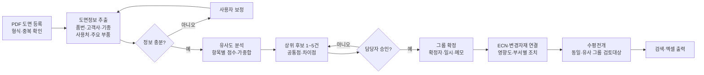

# AI 기반 하네스 유사도면 분류 및 설계변경(ECN) 관리 — 프로젝트 기획서

| 항목 | 내용 |
|---|---|
| 리포 | data09-07 |
| 제출자 | 이창덕 |
| 직무·소속 | 천일테크윈 개발 (첨부 기획서 표지 기재) |
| 과정 | 현장 데이터 디지털화 전문가과정 1차수 |
| 작성일 | 2026-09-28 |
| 문서 상태 | 초안 v0.1 — 수강생 제출 자료 기반 |

제출자는 이미 15쪽 분량의 기획서(2차 개정안, 문제정의·PRD·핵심기능설명서·와이어프레임·플로우차트 포함)를 첨부했습니다. 이 문서는 그 내용을 개발 명세 관점에서 정리하고, 바로 만들 부분과 확인할 부분을 나눈 것입니다. 수치와 기준은 모두 첨부 기획서의 값입니다.

## 1. 추진 배경과 현안

하네스 신규 개발과 설계변경 업무에서는 고객사·기종별 PDF 도면이 계속 쌓입니다. 신규 요청이 오면 담당자가 파일명, 기억, 폴더 구조, 주변 인원의 경험으로 유사 도면을 찾고, ECN이 생기면 변경 전후 도면·BOM·변경자재·적용일·재고처리 정보를 따로따로 확인합니다.

| 문제영역 | 현재 상태 | 업무 영향 |
|---|---|---|
| 도면 검색 | 파일명과 담당자 경험에 의존 | 기준도면 선정 지연 및 재작성 |
| 유사도 판단 | 고객사·기종·형상·BOM을 수작업 비교 | 판단 기준의 개인차 |
| ECN 관리 | 도면·BOM·메일·변경표가 분산 | 변경내용과 적용시점 누락 가능 |
| 변경자재 | 신규·삭제·대체·수량변경을 직접 대조 | 구자재 오사용과 발주 오류 위험 |
| 수평전개 | 변경 영향이 있는 유사 도면 검색이 어려움 | 동일 문제의 반복 가능 |
| 업무 인계 | 과거 판단 근거가 담당자에게 귀속 | 백업 및 법인 이관 어려움 |

핵심 문제문장(원문): PDF 하네스 도면과 설계변경 자료가 축적되고 있으나, 도면 간 유사성 및 ECN 변경이력을 일관된 기준으로 연결하는 체계가 부족하여 검색시간, 판단편차, 변경자재 누락과 수평전개 미흡이 발생합니다.

원인(원문): 공통 분류기준 부재, PDF 도면·BOM·ECN·변경자재 목록의 분산 보관, 경험 의존적 유사도면 선정, 변경 전후 비교 결과를 구조화한 표준 데이터 부족, 변경유형과 적용시점을 함께 관리하는 화면 부재.

## 2. 목표

**최종 목표**
PDF 하네스 도면을 유사 그룹으로 추천하고, 담당자가 확정한 그룹에 ECN과 변경자재 이력을 연결해 도면 검색과 설계변경 영향 검토(수평전개 포함)를 한 곳에서 하도록 합니다. 운영원칙은 **AI는 후보를 추천하고, 최종 분류와 설계변경 판단은 담당자가 승인**하는 것입니다.

**1차 개발 목표 (교육기간 프로토타입)**
제한된 샘플 도면(10~20건)으로 **PDF 등록 → 정보 추출 → 유사 후보 → 그룹 확정 → ECN 이력 연결**을 처음부터 끝까지 시연합니다. 원문의 성공 기준은 도면을 완벽하게 자동 판독하는 것이 아니라, 유사 후보를 일관된 기준으로 제시하고 변경이력을 한 화면에서 확인하는 흐름을 보여 주는 것입니다.

원문의 교육단계 성과지표:

| 지표 | 측정방법 | 교육단계 목표 |
|---|---|---|
| 정보 추출 성공률 | 필수 항목 중 정상 추출 비율 | 샘플 기준 80퍼센트 이상 |
| 유사 후보 적중률 | 상위 3개 후보에 담당자 정답 포함 비율 | 샘플 기준 70퍼센트 이상 |
| 분류 소요시간 | 도면 1건 등록부터 후보 확인까지 | 5분 이내 |
| 변경자재 기록률 | 필수 변경항목이 이력표에 기록된 비율 | 필수항목 100퍼센트 표시 |
| 사용자 통제 | 추천 수정과 최종 승인 가능 여부 | 전 항목 담당자 수정 가능 |

## 3. 보유 데이터

원문 3.5 「주요 데이터 항목」을 그대로 데이터 구조로 씁니다.

| 데이터 | 형태 | 규모·주기 | 비고(민감도 등) |
|---|---|---|---|
| PDF 하네스 도면 | PDF (원본 PDF 우선, 스캔본은 OCR 보조) | 교육용 샘플 10~20건(동일 제품군 중심) | 고객사·품번 포함 — 교육 시 익명화 필요(원문) |
| 도면 정보: 도면 ID, 파일명, 품번, 품명, REV, 고객사, 기종, 사용처, 등록일 | 도면에서 추출 + 수정 | 도면당 1행 | 사용처 예: MAIN, CABIN, ENGINE, PANEL |
| 특징: 주요 커넥터, 회로 수, 분기 수, 주요 전선·보호재, 구조 키워드 | 추출 + 수정 | 도면당 1행 | |
| BOM (선택) | 미확인(엑셀 추정 — (가정)) | 도면별 | 커넥터·단자·전선·보호재 공용률 계산용 |
| 유사도: 비교 도면 ID, 총점, 속성점수, 부품점수, 형상점수, 추천순위 | 계산 결과 | 도면 쌍별 | |
| 그룹: 그룹 ID, 그룹명, 대표도면, 분류기준, 확정자, 확정일 | 담당자 입력 | 그룹별 | |
| ECN: ECN 번호, 변경사유, 변경 전후 REV, 요청일, 적용일, 상태 | 담당자 입력 | 최소 사례 1건(교육용) | 고객사 정보 포함 가능 |
| 변경자재: 자재품번, 변경유형(신규·삭제·대체·수량변경), 변경 전, 변경 후, 수량, 재고처리, 담당부서 | 담당자 입력 또는 전후 BOM 비교 | ECN별 | |

## 4. 해결 방안 개요

원문 6.1~6.3 플로우차트를 개발 흐름으로 옮긴 것입니다.

- **수집**: PDF 도면 업로드(1건 또는 여러 건), 선택 메타정보·BOM·ECN 자료
- **정리**: 텍스트 추출(스캔본은 OCR 보조), 제목란·키워드 분석으로 도면 기본정보·특징 채우기, 담당자 수정
- **분석·AI**: 원문 3.6의 설명 가능한 가중치 방식으로 유사도 계산
  - 고객사·기종·제품군 25퍼센트 / 사용처·품명 20퍼센트 / 주요 부품·BOM 공용성 30퍼센트 / 도면 문자·키워드 15퍼센트 / 간단한 형상 특징 10퍼센트
  - 실제 가중치는 샘플 검증 결과로 조정(원문)
  - 임계값 이상이면 기존 그룹 후보, 미만이면 신규 그룹 후보(원문 6.2)
- **산출물**: 확정 그룹, ECN·변경자재 이력, 수평전개 대상, 엑셀 결과

## 5. 주요 기능

원문 FR-01~FR-10을 기준으로, 1단계 구현 범위를 반영해 우선순위를 표시했습니다.

| 기능 | 설명 | 우선순위 |
|---|---|---|
| 도면 등록 (FR-01) | PDF 1건·여러 건 등록, 파일명·등록상태 표시, 파일명·해시·품번·REV 기준 중복 경고 | MVP |
| 정보 추출 (FR-02) | PDF 텍스트 추출 → 품번·품명·REV·고객사·기종·사용처·키워드 후보, 원문 확인 | MVP |
| 추출정보 수정 (FR-03) | 모든 추출값을 담당자가 수정·저장, 수정값이 분석에 반영, 미인식 항목 경고 | MVP |
| 유사도 추천 (FR-04) | 가중치 방식 총점·항목별 점수, 상위 1~5건, 공통점·차이점 근거 | MVP |
| 가중치·임계값 설정 | 5개 항목 가중치와 기존/신규 그룹 임계값을 화면에서 조정 | MVP |
| 그룹 확정 (FR-05) | 기존 그룹 연결·후보 변경·제외·신규 그룹 생성, 확정자·일시·메모 기록 | MVP |
| 검색 (FR-06) | 품번·고객사·기종·사용처 조건 검색 | MVP |
| ECN 연결 (FR-07) | ECN 번호, 변경 전후 도면·REV, 변경사유, 요청일·적용일, 상태 | MVP |
| 변경자재 기록 (FR-08) | 신규·삭제·대체·수량변경, 변경 전후 값·수량, 재고처리, 담당부서 | MVP |
| 엑셀 출력 (FR-09) | 필터 결과, ECN 요약표, 변경자재 목록, 부서별 조치사항 | MVP (원문은 선택) |
| 대시보드 | 전체 도면 수, 미분류 도면, 검토대기, 진행 중 ECN, 지연 ECN | 확장 |
| ECN 영향도·부서별 조치 | BOM·작업지시서·조립 JIG·검사 JIG·구매발주·품질승인 영향 지정, 담당자·완료예정일·완료일, 필수정보 미정 시 완료 처리 제한 | 확장 |
| 수평전개 표시 | ECN 완료 시 동일 그룹·유사 도면을 추가 검토대상으로 표시 | 확장 |
| 전후 BOM 자동 비교 | 두 BOM을 비교해 변경유형 자동 분류 | 확장 |
| OCR 보조 | 스캔 PDF 문자 인식(DAY3 멀티모달) | 확장 |
| AI 추출 보조 | 제목란·주기 문장에서 필드를 생성형 AI로 추출(익명화 후) | 확장 |
| 형상·회로 정밀 비교 (FR-10) | PDF 형상과 회로 변경점 표시 | 확장(원문: 향후) |

## 6. 기대 산출물

- 브라우저에서 도는 유사도면 분류·ECN 관리 웹 도구(시연 화면: 대시보드, 도면 등록·분석, 유사도 결과·그룹 확정, ECN·변경자재)
- 도면 정보·특징 표, 유사도 결과 표, 그룹 목록, ECN 이력표, 변경자재 목록(엑셀)
- 검증 결과: 상위 후보 적중 여부, 처리시간, 추출 오류 및 보정 결과(원문 7절)
- 원문의 기획 산출물(문제정의·PRD·핵심기능설명서·와이어프레임·플로우차트)은 제출자가 이미 작성 완료

## 7. 기술 구성

| 과정 도구 | 이 과제에서의 쓰임 |
|---|---|
| 코랩(Python) | 샘플 PDF 텍스트 추출·가중치 유사도 계산을 먼저 검증, 적중률(상위 3개) 측정 (DAY2) |
| 멀티모달(OCR·도면) | 스캔 도면 문자 인식, 제목란 영역 인식 (DAY3, 확장) |
| Dify / NotebookLM | ECN 이력·과거 판단 메모를 넣어 "이 품번과 비슷한 과거 변경"을 묻는 노하우 조회 (DAY4, 확장) |
| Make | ECN 등록 시 관련 부서에 Gmail 알림, Sheets에 이력 기록 (DAY5, 확장) |
| 생성형 AI | 추출 보조, 유사도 근거 문장화 (익명화 전제) |

**개발 빌드**: 설치 없이 브라우저에서 도는 정적 웹 도구로 만듭니다.
- PDF 텍스트 추출은 브라우저 안에서 처리(pdf.js 등)해 도면이 외부로 나가지 않게 합니다. 원문 위험관리의 "회사정보 보안 — 외부 AI 입력 위험"에 맞춘 선택입니다.
- 데이터 저장은 1단계에서 브라우저 안 저장 + JSON/엑셀 내보내기·불러오기로 합니다(가정). 여러 부서가 같은 데이터를 봐야 하는 단계에서 공용 저장소(사내 공유 폴더의 엑셀 또는 DB)를 정합니다.
- 원문 비기능 요구(추적성: 수정자·승인자·수정일·ECN 상태 이력 보존, 확장성: 향후 OCR·BOM DB·PLM·ERP·MES 연결)를 데이터 구조에 반영해 3절의 항목을 그대로 테이블로 둡니다.

## 8. 개발 단계

**1단계 — 지금 바로 개발 가능한 부분**
원문에 데이터 항목, 가중치, 화면 구성, 예외처리, 완료 기준이 모두 정의되어 있어 다음은 샘플 도면 없이도 바로 만들 수 있습니다.
- 화면 4종 골격(대시보드, 도면 등록·분석, 유사도 결과·그룹 확정, ECN·변경자재)과 화면 이동(대시보드 ↔ 도면 상세 ↔ ECN, ECN에서 대상 도면·유사 그룹으로 역이동)
- PDF 업로드·미리보기·텍스트 추출, 추출정보 편집 폼, 중복 경고
- 원문 3.6 가중치 방식 유사도 계산(가중치·임계값 조정 가능), 상위 1~5건과 공통점·차이점 표시
- 그룹 확정(확정자·일시·메모), 검색, ECN·변경자재 등록, 엑셀 출력
- 검증은 익명화된 가상 도면 정보로 먼저 하고(가정), 제출자의 샘플 PDF 10~20건을 받으면 추출 규칙을 실제 제목란 양식에 맞춥니다.

**2단계**
- 실제 샘플 PDF 10~20건으로 제목란·품번 패턴 추출 규칙 조정 → 정보 추출 성공률 80퍼센트 이상 확인
- BOM 연결로 주요 부품·BOM 공용성(30퍼센트 항목) 계산
- 상위 3개 후보 적중률 70퍼센트 이상 확인, 가중치 조정
- ECN 사례 1건으로 데모 시나리오 10분 이내 시연 점검

**3단계**
- ECN 영향도·부서별 조치·완료 조건 관리, 수평전개 표시, 대시보드 지표
- 스캔 도면 OCR, 간단한 형상 특징(외곽·분기 수·배치) 추출
- Make 알림, Dify 이력 조회, 사내 공용 저장소 연결
- 향후: 형상·회로 정밀 비교, PLM·ERP·MES 연계(원문 고도화 범위)

## 9. 기대 효과

- 유사 도면을 파일명·기억 대신 일관된 기준(가중치 점수와 근거)으로 찾아 기준도면 선정이 빨라지고 판단 편차가 줄어듭니다.
- ECN과 변경자재(신규·삭제·대체·수량변경), 적용일·재고처리를 한 화면에 묶어 구자재 오사용·오발주·적용시점 누락 위험을 낮춥니다.
- 확정 그룹을 따라 유사 도면을 검토대상으로 띄워 수평전개 누락을 줄입니다.
- 판단 근거(확정자·메모)가 기록으로 남아 업무 인계·법인 이관이 쉬워집니다.
- 부서별 기대효과(원문 1.5): 개발 — 기준도면 탐색·비교시간 단축, 설계 — 과거 변경이력 확인, 생산기술 — 변경 대상 치공구 사전 확인, 구매·자재 — 변경자재 누락·오발주 예방, 품질 — 연관 제품 검토범위 확보, 관리자 — 보고자료·의사결정 근거 확보

## 10. 확인 필요 사항

1. 익명화된 샘플 PDF 도면 10~20건과 ECN 사례 1건(원문 7절 데이터) — 제공 시점
2. 도면 PDF가 CAD에서 내보낸 텍스트 PDF인지, 스캔본인지 비율
3. 제목란 양식이 고객사별로 몇 종인지, 품번·REV 표기 규칙(예시 1~2개)
4. 사용처·제품군 분류 체계의 전체 목록(원문 예시: MAIN, CABIN, ENGINE, PANEL)
5. BOM 자료 형태(엑셀 컬럼)와 도면과의 연결 키(품번+REV인지)
6. 유사도 임계값 초기값(원문은 "임계값"만 기재)
7. 유사 후보 적중률 채점용 "담당자 정답" 그룹 목록 — 샘플 도면별로 어느 그룹이 맞는지
8. ECN 상태 값의 종류(예: 접수·검토·적용·완료 등 — 원문에 목록 없음)
9. 여러 부서가 같은 데이터를 공유해야 하는지, 사내에서 쓸 수 있는 공용 저장소(공유 폴더·사내 서버)
10. 외부 AI(생성형 AI·Dify 클라우드) 사용 가능 범위 — 사내 보안정책
11. 샘플 대상 하네스의 고객사·기종 범위(원문 "기종" 필드에 들어갈 값 확인용)

## 부록. 제출 원문 요약

- 게시물 1 (2026-09-09) 「AI 기반 하네스 유사도면 분류 및 설계변경 관리 기획서」: "유사도면의 그룹화, ECN 자료의 기록 관리 철저"
- 첨부 `att/01_AI__________ECN_____1_.pdf` (15쪽, 2차 개정안 플로우차트 개선): 문서 개요, 문제정의(1.1~1.5), 기획서(과제 개요·추진 목표·범위·단계별 계획·성과지표·위험관리), PRD(제품 정의·사용자 시나리오·FR-01~FR-10·비기능 요구·데이터 항목·유사도 가중치·완료 기준), 핵심기능설명서·예외처리, 와이어프레임(5.1~5.5), 플로우차트(6.1 전체 업무 흐름, 6.2 도면 분석 및 그룹화, 6.3 ECN 처리 — 그림은 PDF를 직접 열어 확인), 교육기간 결과물 정의, 다음 작성 범위
- 첨부 텍스트 추출본 `att/01_AI__________ECN_____1_.pdf.txt` — 모두 읽음, 읽지 못한 파일 없음
